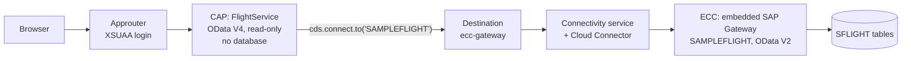

# ECC-to-CAP Starter Kit

A reference path from a running SAP ECC system to your first clean-core extension, built with the SAP Cloud Application Programming Model (CAP).

[](https://github.com/sebastianomarchesini/ecc-to-cap-starter-kit/actions/workflows/ci.yml)
[](LICENSE)

You have a running ECC. It works, and it is not going anywhere this year. This kit shows how to start building cloud applications on top of it today, without touching the core and without waiting for a migration you have not started.

It is a small, read-only CAP service that reads ECC's standard flight sample (`SAMPLEFLIGHT`) through SAP Gateway, the Cloud Connector and a destination, and a Fiori elements List Report and Object Page on top. There is no database and nothing is written back. ECC is not modified.

> Presented at **SAP Devtoberfest 2026** (Building Apps track) as *The ECC-to-CAP Starter Kit*. The slides are in [`docs/slides/`](docs/slides/).

## Why now

Mainstream maintenance for the core applications of SAP Business Suite 7, which include ECC 6.0 on enhancement packages 6 to 8, runs until the end of 2027. Optional extended maintenance follows until the end of 2030 ([SAP News, 4 February 2020](https://news.sap.com/2020/02/sap-s4hana-maintenance-2040-clarity-choice-sap-business-suite-7/)). That is a reason to plan a migration. It is not a reason to stop building.

ECC already speaks OData through SAP Gateway. An extension built against that interface today keeps its service contract, its UI and its tests when the backend becomes SAP S/4HANA. Only the seam changes. See [Moving to SAP S/4HANA](docs/s4hana-transition.md).

## How it works



The request path, and where each piece runs, is described in [docs/architecture.md](docs/architecture.md).

## The whole kit in five files

| File | What it does |
|---|---|
| [`srv/external/SAMPLEFLIGHT.cds`](srv/external/SAMPLEFLIGHT.cds) | The ECC contract, generated by `cds import` from the service's `$metadata`, with one hand edit (the flight date) |
| [`srv/flight-service.cds`](srv/flight-service.cds) | Five lines of CDS: two read-only projections. This is the seam |
| [`srv/flight-service.js`](srv/flight-service.js) | One line of JavaScript: forward each read to ECC |
| [`app/flightproject/annotations.cds`](app/flightproject/annotations.cds) | The whole UI: labels, filter fields, columns, Object Page |
| [`package.json`](package.json) (`cds.requires`) | Which destination and service path to use, per profile |

Everything else is generated scaffolding (`mta.yaml`, the approuter, the Fiori app shell), sample data for mock mode, and tests.

## Quick start

You need Node.js 22 or later. The CAP command line (`npm i -g @sap/cds-dk`) is useful but not required, because the scripts use the local copy.

### Level 1: no backend (about five minutes)

```sh
git clone https://github.com/sebastianomarchesini/ecc-to-cap-starter-kit.git
cd ecc-to-cap-starter-kit
npm ci
npm run watch
```

Open <http://localhost:4004>, choose `/flightproject/index.html` and press **Go**. With no credentials in the default profile, CAP mocks the ECC service in-process and serves the sample rows in [`srv/external/data/`](srv/external/data/). You need no ECC and no platform account for this step.

### Level 2: against your ECC, from SAP Business Application Studio

1. Prepare ECC and the connection: activate `SAMPLEFLIGHT`, expose `/sap/opu/odata` in the Cloud Connector and create a destination named `ecc-gateway`. Step by step: [docs/ecc-setup.md](docs/ecc-setup.md).
2. Route the dev space through the destination:

   ```sh
   cp default-env.json.example default-env.json   # local only, git ignores it
   npm run bas                                     # cds watch --profile bas
   ```

3. Check the log for `connect to SAMPLEFLIGHT > odata-v2 { destination: 'ecc-gateway', ... }`. If it says *mocking*, the profile is not applied.
4. If something fails, the two calls in [`test/flight.http`](test/flight.http) tell you which half of the path is broken.

Your system may differ. The service may be `RMTSAMPLEFLIGHT` rather than `SAMPLEFLIGHT`, and your destination may have another name. Change `credentials.path` and `credentials.destination` in `package.json`, or override them without editing anything:

```sh
cds_requires_SAMPLEFLIGHT_credentials_destination=MY_ECC npm run bas
```

### Level 3: deploy to Cloud Foundry

With the MTA Build Tool installed globally (`npm i -g mbt`; SAP Business Application Studio has it preinstalled):

```sh
cf login
npm run build      # mbt build --mtar archive
npm run deploy     # cf deploy mta_archives/archive.mtar
```

Open the application through the approuter route: `https://<approuter-route>/flightproject/index.html`. Calling the CAP service URL directly returns 401, which is correct: the service expects the token that the approuter obtains at login.

## Tests

```sh
npm test
```

Fourteen tests run in about two seconds, and none of them needs an ECC:

- **[Mock mode](test/mocked.test.js)** serves exactly what a bare `cds watch` serves. It covers filtering, counting, the key read the Object Page makes, the read-only rules, and the UI annotations in `$metadata`.
- **[The Gateway contract](test/gateway-contract.test.js)** runs the live code path against a stand-in for SAP Gateway that answers in OData V2 and records what CAP sends. It checks that `$filter`, `$orderby` and `$top` reach ECC, that dates travel as V2 `datetime'…'` literals in filters and keys, and that the flight date comes back as a calendar date the UI can send back as a key.

[CI](.github/workflows/ci.yml) runs the tests and a production build on every push. It also fails if saved metadata still contains a host name or if `default-env.json` has been committed.

## Ten traps, and none of them is in ECC

Each of these cost time while building the kit. Symptoms, causes and fixes are in [docs/troubleshooting.md](docs/troubleshooting.md).

1. The BAS Service Center shows an empty list.
2. 404 on the service name every blog post uses.
3. The handler never loads: `fligh-service.cds` next to `flight-service.js`.
4. `require is not defined`: new CAP projects are ES modules.
5. `ENOTFOUND …dest`: Node's `fetch` ignores the dev space proxy.
6. Still `ENOTFOUND` after the Fiori generator: the SAP Cloud SDK needs `default-env.json`.
7. A plain 500 from the BAS proxy: `HTML5.DynamicDestination` is missing.
8. Flights one day early, then an Object Page that cannot load: `Edm.DateTime` and the time zone.
9. "Failed to resolve destination" on Cloud Foundry: destination names are case-sensitive there.
10. Your internal host name inside a file you are about to commit.

## Build it yourself

[docs/workshop.md](docs/workshop.md) rebuilds the kit from an empty dev space, one step per section, with a checkpoint after each step. That is the path the Devtoberfest session follows.

## Repository layout

```text
app/
  flightproject/          Fiori elements app (List Report + Object Page), annotations.cds
  router/                 standalone approuter
  services.cds            pulls the annotations into the model
srv/
  external/
    SAMPLEFLIGHT.edmx     $metadata saved from ECC, host links removed
    SAMPLEFLIGHT.cds      generated by cds import, one hand edit
    data/                 synthetic sample rows for mock mode
  flight-service.cds      the service: two read-only projections
  flight-service.js       the implementation: one line
test/                     mock-mode tests, Gateway contract test, flight.http
scripts/                  strip-metadata-links.mjs
docs/                     architecture, ECC setup, troubleshooting, S/4HANA transition, workshop, slides
mta.yaml                  deployment descriptor (Cloud Foundry)
```

## Related

- *Integrating S/4HANA Public Cloud APIs into CAP Made Simple*, SAP Devtoberfest 2025: [recording](https://www.youtube.com/watch?v=7m22NubgqME), [event page](https://community.sap.com/t5/devtoberfest/integrating-s-4hana-public-cloud-apis-into-cap-made-simple/ec-p/14214711). The same CAP consumption pattern, with a cloud backend.
- CAP documentation: [consuming services](https://cap.cloud.sap/docs/guides/using-services), [configuration profiles](https://cap.cloud.sap/docs/node.js/cds-env), [Fiori elements](https://cap.cloud.sap/docs/advanced/fiori), [deploying to Cloud Foundry](https://cap.cloud.sap/docs/guides/deployment/to-cf).
- [ABAP Flight Reference Scenario](https://github.com/SAP-samples/abap-platform-refscen-flight), SAP's RAP rebuild of the flight model and the S/4HANA side of the swap.

## Contributing

Ran the kit against your own landscape? Open an issue and tell me what broke, because that is how the kit gets better. Please read [CONTRIBUTING.md](CONTRIBUTING.md) before you paste logs: they often contain host names, client numbers and user names.

## Citing

If you build on this kit in a publication, a course or another repository, GitHub's **Cite this repository** button (from [CITATION.cff](CITATION.cff)) gives you a ready-made reference.

## License and notices

The code is licensed under the [Apache License 2.0](LICENSE). The slide deck in `docs/slides/` is provided for reference and is not covered by that license. See [NOTICE](NOTICE) for trademarks and third-party material. This is a personal community project; it is not an SAP product and is not endorsed by SAP SE.

## Author

**Sebastiano Marchesini**, SAP Champion, New York. [LinkedIn](https://www.linkedin.com/in/sebastiano-marchesini/) · [sebastianomarchesini.com](https://sebastianomarchesini.com)
