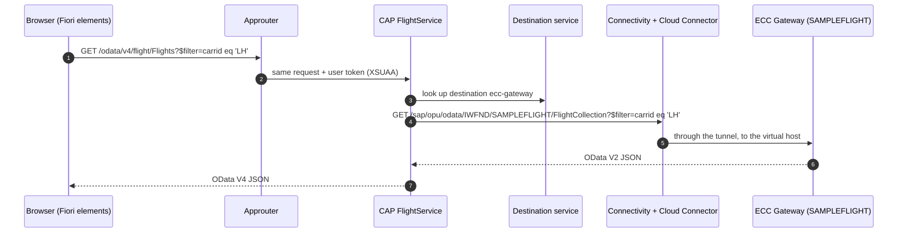

# Architecture

One read path, from a browser to the SFLIGHT tables in ECC, and back. Every piece on it is standard; the kit's own code is the part in the middle.



## The pieces

| Piece | Runs in | Role |
|---|---|---|
| Fiori elements app (`app/flightproject`) | HTML5 Application Repository, served through the approuter | List Report and Object Page, rendered from annotations. There is no UI5 code. |
| Approuter (`app/router`) | Cloud Foundry | Log-in with XSUAA, then forwards `/odata` calls to CAP with the user's token. |
| CAP service (`srv/`) | Cloud Foundry, Node.js | Serves `FlightService` as OData V4 and forwards every read to ECC. |
| Destination `ecc-gateway` | Destination service (subaccount level) | Holds the ECC address and the technical user. Your code only knows its name. |
| Connectivity service + Cloud Connector | platform + your network | Tunnels HTTP from the platform to ECC. Only `/sap/opu/odata` is exposed. |
| `SAMPLEFLIGHT` | ECC, embedded SAP Gateway (`SAP_GWFND`) | SAP-delivered OData V2 service over the SFLIGHT tables. No ABAP to write. |

## What CAP does on each request

`srv/flight-service.js` registers one handler:

```js
this.on('READ', ['Flights', 'Carriers'], req => ecc.run(req.query))
```

`req.query` is the incoming OData V4 request, already parsed into a query. `ecc.run()` hands it to the remote service, which:

1. resolves the projection `FlightService.Flights` to the imported entity `SAMPLEFLIGHT.FlightCollection`;
2. writes it as an OData V2 URL: `$select`, `$filter`, `$orderby`, `$top`, `$skip`, and `$inlinecount` for `$count`, with V2 literals such as `datetime'2026-11-25T00:00:00'` for dates;
3. calls ECC through the destination;
4. converts the V2 response (`d.results`, `/Date(…)/`) back into plain values, which CAP serves as OData V4.

Filtering and sorting therefore run in ECC, not in CAP. CAP holds no data it could filter. [`test/gateway-contract.test.js`](../test/gateway-contract.test.js) pins this behavior down against a Gateway stand-in.

## Why there is no database

The kit is a pass-through. A database would bring a copy of ECC data to keep in sync, a schema to deploy, and a service instance to pay for, with no gain for a read-only screen. Every read is live.

The consequence: the app is as fast as the Gateway service and the tunnel. For list screens over SFLIGHT that is fine. For heavy analytics it is not, and a replicated or cached design would be the next step.

Mock mode (`cds watch` with no credentials) is the one exception. CAP then serves the imported ECC service in-process from an in-memory SQLite database, filled from `srv/external/data/*.csv`.

## The seam

`srv/flight-service.cds` is five lines:

```cds
using SAMPLEFLIGHT as ecc from './external/SAMPLEFLIGHT';

service FlightService {
  @readonly entity Flights  as projection on ecc.FlightCollection;
  @readonly entity Carriers as projection on ecc.CarrierCollection;
}
```

The UI binds to `FlightService`, never to ECC's model. Today the projections pass ECC's names straight through. When the backend becomes S/4HANA, they start mapping (`AirlineID as carrid`), and the UI, its annotations and the tests keep the names they already use. Everything to the left of this file is yours; everything to the right belongs to one specific system. See [s4hana-transition.md](s4hana-transition.md).

## Security model

| Concern | In this kit | Next step for production |
|---|---|---|
| Who may open the app | Any user who can log in through XSUAA. `xs-security.json` defines no roles. | Add a role, and `@requires` on the service. |
| How ECC sees the caller | One technical user, `BasicAuthentication` on the destination | Principal propagation, so ECC authorizes the real user |
| Direct calls to the CAP URL | Rejected with 401. In production CAP requires an authenticated user for every service unless a service is explicitly opened. | Keep it that way |
| Writes | Impossible: both entities are `@readonly` (405), and nothing is forwarded to ECC | Write-back needs CSRF token handling and `$batch` |
| What reaches the network | Only `/sap/opu/odata`, exposed in the Cloud Connector | Expose only the service paths you use |

A technical user is the simplest thing that works, and it is also the weakest part of this design. Every reader sees what the technical user may see. Treat it as a starting point.

## Deliberately left out

Kyma, multitenancy, CI/CD pipelines on the platform, messaging, the SAP Build Work Zone portal, logging and notification services. None of them is needed for a read path, and every service you add ends up in `mta.yaml`, where it is yours to run.
